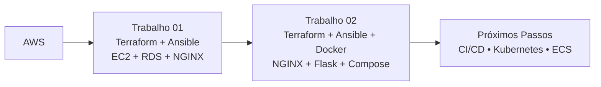

# Repositório de Computação em Nuvem & DevOps


Este repositório reúne os projetos práticos desenvolvidos para a disciplina de Computação em Nuvem, focados na aplicação de **Infraestrutura como Código (IaC)**, **Automação de Configuração** e **Conteinerização** utilizando a nuvem da AWS.

A evolução do aprendizado está organizada em duas etapas principais, demonstrando a transição de uma arquitetura tradicional baseada em máquinas virtuais para uma arquitetura moderna baseada em contêineres.

---

## Jornada de Aprendizado



---

## Projetos Desenvolvidos

### Trabalho 01 — Infraestrutura Tradicional com Banco de Dados

A primeira etapa foca no provisionamento de uma arquitetura tradicional baseada em máquinas virtuais na nuvem, integrando uma camada de computação a um banco de dados gerenciado.

**Infraestrutura**

* Instância EC2 Ubuntu
* Amazon RDS PostgreSQL 16
* Security Groups para controle de acesso

**Automação**

* Provisionamento da infraestrutura com Terraform
* Configuração automatizada com Ansible
* Instalação e configuração do NGINX diretamente na máquina virtual
* Publicação automática de página HTML

📁 Documentação:

[Saiba mais](./trabalho-01/README.md)

---

### Trabalho 02 — Aplicação Conteinerizada com Docker & Proxy Reverso

A segunda etapa evolui a arquitetura para um modelo baseado em contêineres, substituindo a execução direta na máquina virtual por serviços isolados e independentes.

**Infraestrutura**

* Instância EC2 Ubuntu atuando como Host Docker
* Security Groups para acesso HTTP e SSH

**Automação**

* Provisionamento da infraestrutura com Terraform
* Configuração automatizada com Ansible
* Instalação do Docker e Docker Compose
* Deploy automatizado da aplicação

**Conteinerização**

* Docker Compose gerenciando uma rede privada `devops`
* Contêiner NGINX atuando como proxy reverso
* Duas instâncias da aplicação Python Flask (*showip*)
* Comunicação interna entre serviços através da rede Docker

📁 Documentação:

[Saiba mais](./trabalho-02/README.md)

---

## Tecnologias e Conceitos Explorados

### Computação em Nuvem

* Amazon Web Services (AWS)
* EC2
* Amazon RDS
* Security Groups

### Infraestrutura como Código (IaC)

* Terraform
* Módulos reutilizáveis
* Outputs
* Variáveis
* Provisionamento automatizado

### Automação de Configuração

* Ansible
* Playbooks
* Roles
* Inventários dinâmicos

### Conteinerização

* Docker
* Dockerfile
* Docker Compose
* Redes Docker

### Desenvolvimento Web

* Python
* Flask
* Gunicorn
* NGINX Proxy Reverso

---

## Estrutura do Repositório

```bash
.
├── trabalho-01/
│   ├── terraform/
│   └── ansible/
│
└── trabalho-02/
    ├── terraform/
    ├── ansible/
    └── arquivos_do_app/
```

### Organização dos Projetos

| Projeto     | Objetivo                                                                  |
| ----------- | ------------------------------------------------------------------------- |
| Trabalho 01 | Provisionamento de infraestrutura tradicional com EC2, RDS e NGINX        |
| Trabalho 02 | Deploy automatizado de aplicação conteinerizada utilizando Docker Compose |

---

## Competências Desenvolvidas

Ao longo dos projetos foram aplicados conceitos relacionados a:

* Computação em Nuvem
* Infraestrutura como Código (IaC)
* Provisionamento automatizado
* Gerenciamento de configuração
* Conteinerização
* Redes e segurança
* Proxy reverso
* Modularização de projetos
* Boas práticas de documentação
* Automação de ambientes

---

## Próximos Passos

Os próximos estudos e evoluções planejadas incluem:

* Integração Contínua e Entrega Contínua (CI/CD)
* GitHub Actions
* Kubernetes
* Amazon ECS
* Monitoramento e Observabilidade
* Arquiteturas distribuídas

---

## Observações Acadêmicas

Os projetos contidos neste repositório possuem finalidade acadêmica e foram desenvolvidos para consolidar conhecimentos em Computação em Nuvem, DevOps, Infraestrutura como Código (IaC), automação de configuração, conteinerização e documentação técnica, seguindo práticas amplamente utilizadas no mercado.
