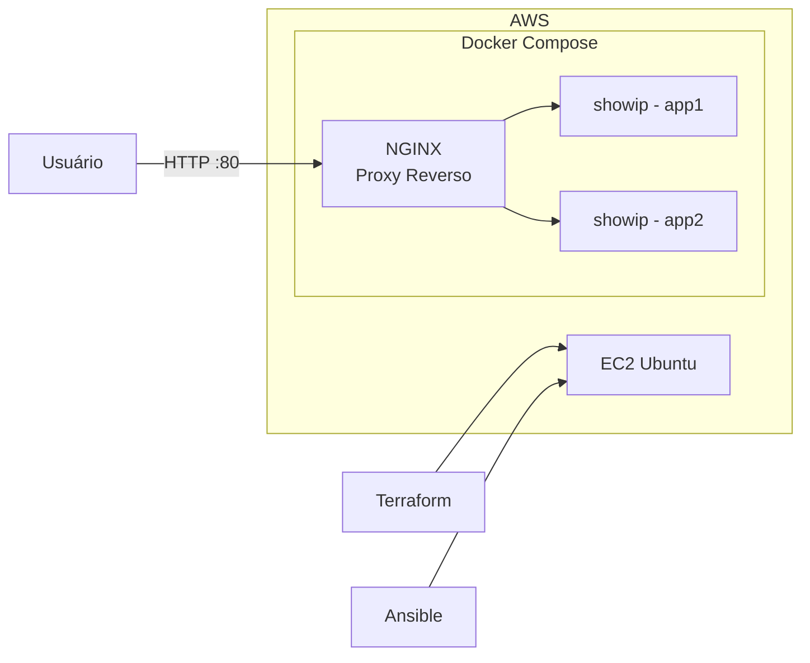

# Trabalho de Computação em Nuvem

Projeto desenvolvido utilizando **Terraform**, **Ansible** e **Docker Compose** para provisionamento e implantação automatizada de uma aplicação conteinerizada na AWS.

---

# Objetivo

O objetivo deste projeto é demonstrar a utilização de ferramentas de **Infraestrutura como Código (IaC)**, automação de configuração e **conteinerização** para provisionar um ambiente composto por:

* Uma instância EC2 na AWS;
* Docker e Docker Compose instalados e configurados automaticamente via Ansible;
* Uma aplicação composta por múltiplos contêineres (NGINX como proxy reverso e duas instâncias da aplicação Python *showip*).

---

# Arquitetura

A infraestrutura provisionada é composta pelos seguintes recursos:

## Diagrama da Arquitetura



## Compute

* Instância EC2 Linux (Ubuntu)

## Rede e Segurança

* Security Group

  * SSH (porta 22)
  * HTTP (porta 80)

## Orquestração e Contêineres

* Docker Compose gerenciando a rede interna `devops` com 3 contêineres:
  * Contêiner `nginx`: Proxy reverso escutando na porta 80.
  * Contêiner `app1`: Instância da aplicação Python *showip*.
  * Contêiner `app2`: Segunda instância da aplicação Python *showip*.

## Configuração

Após a criação da infraestrutura pelo Terraform, o Ansible é responsável por:

* Atualizar os pacotes do sistema operacional;
* Instalar o Docker e o plugin do Docker Compose;
* Adicionar o usuário `ubuntu` ao grupo do Docker;
* Copiar os arquivos da aplicação para a instância;
* Construir a imagem Docker localmente e subir os contêineres.

---

# Estrutura do Projeto

```bash
.
├── README.md
├── .gitignore
├── docs/
├── scripts/
├── terraform/
└── ansible/
```

> **Observação:** Os arquivos `inventory.ini` e `ansible.cfg` são gerados automaticamente pelos scripts `deploy.sh` e `destroy.sh`. Caso a execução seja realizada manualmente, eles deverão ser criados conforme a documentação em `docs/SCRIPTS.md`.

---

# Tecnologias Utilizadas

## Terraform

Responsável pelo provisionamento da infraestrutura AWS:

* EC2
* Security Group (portas 22 e 80)

Documentação específica:

[Saiba mais](./terraform/README.md)

---

## Ansible

Responsável pela configuração da instância EC2 e deploy:

* Instalação do Docker e Docker Compose
* Transferência dos arquivos da aplicação
* Inicialização da aplicação conteinerizada via Docker Compose

Documentação específica:

[Saiba mais](./ansible/README.md)

## Docker, Docker Compose e Python (Flask/Gunicorn)

Responsável pelo empacotamento, isolamento e execução da aplicação:

* Criação de imagem leve com Python e servidor web Gunicorn
* Orquestração de serviços com Docker Compose em rede privada
* Execução de instâncias dinâmicas backend para retorno de IPs internos

Documentação específica:

[Saiba mais](./arquivos_do_app/README.md)

---

# Pré-requisitos

Antes de executar o projeto, é necessário possuir:

* Conta AWS ou AWS Academy Lab
* AWS CLI configurada
* Terraform instalado
* Ansible instalado
* Chave SSH utilizada pela instância EC2
* Linux ou macOS (recomendado)

---

# Arquivos de Configuração

As variáveis do Terraform são definidas em:

```text
terraform/terraform.tfvars
```

Caso o arquivo não exista, copie o modelo:

```bash
cp terraform/terraform.tfvars.example terraform/terraform.tfvars
```

Depois edite os valores conforme necessário.

---

# Execução do Projeto

O projeto pode ser executado de duas formas:

## Utilizando os Scripts

Deploy completo:

```bash
./scripts/deploy.sh
```

Remoção completa:

```bash
./scripts/destroy.sh
```

---

## Execução Manual

Todos os comandos necessários para:

* Terraform
* Ansible
* Testes
* Verificação dos recursos
* Destruição da infraestrutura

estão documentados em:

[Saiba mais](docs/SCRIPTS.md)

---

# Fluxo de Execução

1. Configurar credenciais AWS;
2. Configurar variáveis do Terraform;
3. Executar Terraform;
4. Provisionar EC2 e Security Group;
5. Obter o IP da EC2;
6. Executar o Ansible;
7. Instalar Docker e Docker Compose na EC2;
8. Enviar os arquivos e subir os contêineres da aplicação;
9. Validar acesso via navegador ou curl;
10. Destruir a infraestrutura ao final dos testes.

---

# Resultados Esperados

Após a execução do projeto:

## EC2

Uma instância EC2 deve estar disponível e acessível via SSH.

## Docker e Contêineres

Três contêineres devem estar em execução dentro da instância EC2 de forma isolada.

## NGINX / Aplicação

Ao acessar as rotas no navegador ou via terminal:

```bash
http://IP_DA_EC2/app1
http://IP_DA_EC2/app2
```

O servidor deve responder com sucesso em ambas as URLs, exibindo endereços IP internos **diferentes** para cada rota, comprovando que o NGINX está direcionando o tráfego para contêineres distintos.

---

# Observações

Este projeto possui finalidade acadêmica e foi desenvolvido para demonstrar:

* Infraestrutura como Código (IaC);
* Provisionamento automatizado com Terraform;
* Automação de configuração e deploy com Ansible;
* Implantação de microsserviços com Docker Compose;
* Modularização de projetos;
* Boas práticas de organização e documentação.

---

# Documentação Complementar

Documentação geral de execução:

[Saiba mais](./docs/SCRIPTS.md)


Documentação do Terraform:

[Sabia mais](terraform/README.md)


Documentação do Ansible:

[Sabia mais](ansible/README.md)

Documentação da API:

[Sabia mais](arquivos_do_app/README.md)
